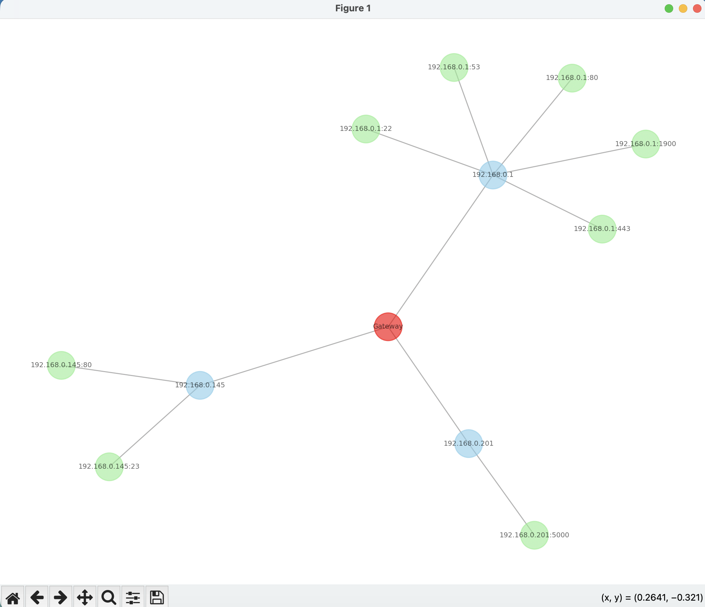

# Pathfinder Scanner

Pathfinder Scanner is a Python-based cybersecurity tool for mapping visible network services and organizing them into an attack-surface report. It was built as a practical exploration of asset discovery, service fingerprinting, and vulnerability-oriented thinking.

The project focuses on the early phase of security assessment: understanding what is exposed before deciding what needs deeper testing or remediation.

## Network Topology Visualization

## Project Goals

1. **Asset Discovery** — identify active hosts in a target network.
2. **Service Fingerprinting** — inspect open ports and detect service/version information.
3. **Risk Mapping** — connect discovered services to possible security concerns and CVE investigation paths.
4. **Reporting** — produce structured output that can be reviewed or integrated into a security workflow.

## Key Features

- Uses `nmap` for port and service discovery
- Extracts service names and versions for follow-up research
- Produces structured JSON-style attack-surface reporting
- Includes a network visualization artifact
- Designed with an extensible Python structure for future CVE enrichment

## Technical Stack

| Area | Tools |
| --- | --- |
| Language | Python 3.11+ |
| Scanning | Nmap / python-nmap |
| Data handling | JSON, socket utilities |
| Future integrations | NIST NVD API / CVE enrichment |

## How It Works

1. Identify the local network context.
2. Scan selected hosts and ports.
3. Collect service names, versions, and protocol details.
4. Normalize findings into a report format.
5. Use the results to guide manual review and security prioritization.

## Security Skills Demonstrated

- Network reconnaissance fundamentals
- Service fingerprinting and attack-surface mapping
- Thinking in terms of security risk and prioritization
- Python automation for security workflows
- Structured reporting for technical findings

## Responsible Use Note

This tool is intended for educational use and authorized environments only. Network scanning should only be performed on systems you own, administer, or have explicit permission to assess.

## Roadmap

- Live NIST NVD API integration for CVE descriptions and CVSS scores
- Visual attack graphs with DOT/Graphviz
- Safer scan profiles for different environments
- Exportable HTML or Markdown reports

## Status

Cybersecurity portfolio project demonstrating infrastructure analysis and risk-assessment concepts.